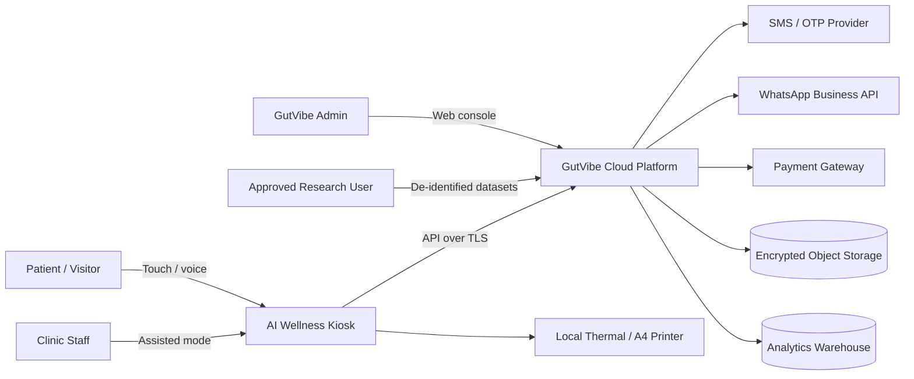
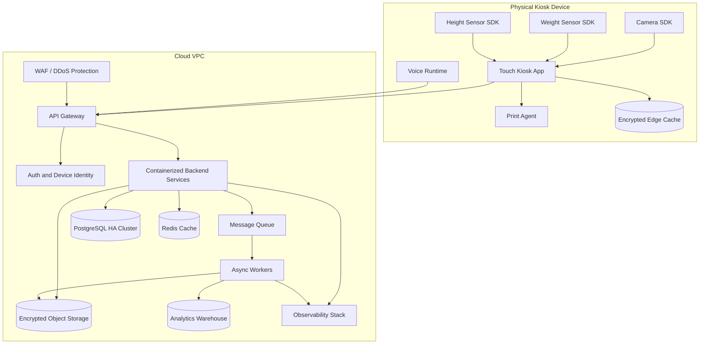
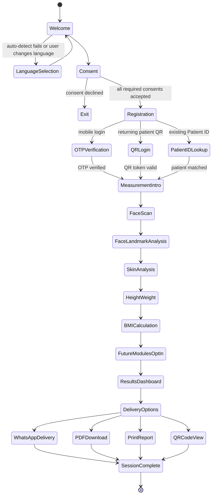
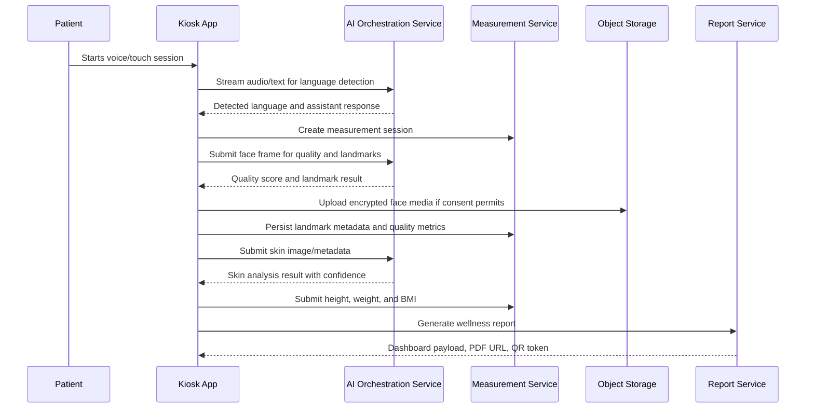
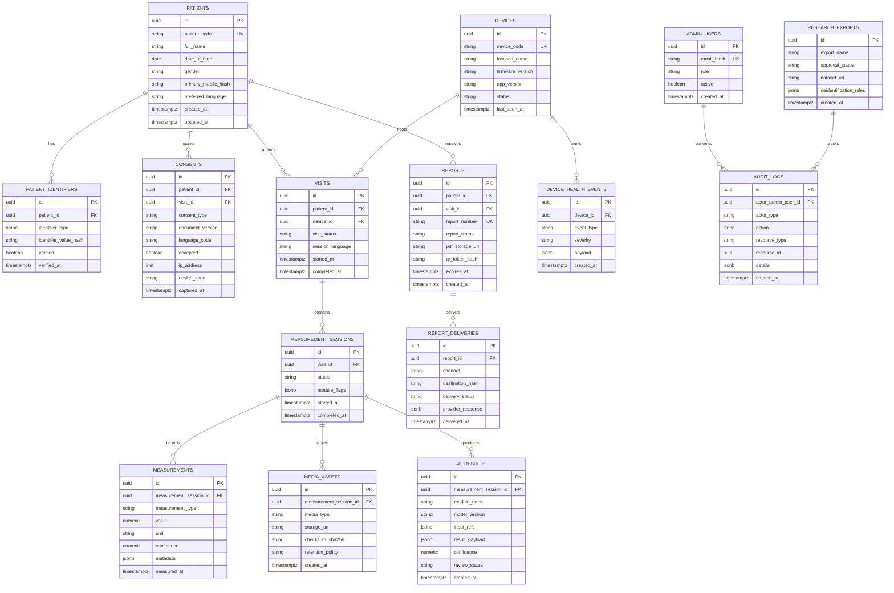
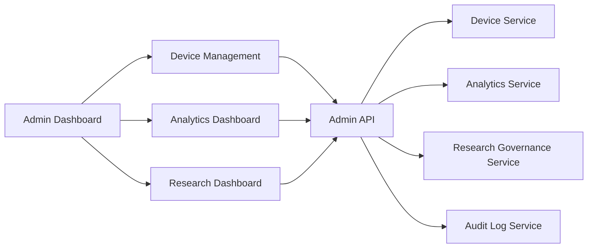

# Phase 4 Architecture: GutVibe AI Wellness Kiosk

## 1. Architecture goals

This document defines the production-ready software architecture for the Phase 4 GutVibe AI Wellness Kiosk. It is an architecture specification only and intentionally does not include application code.

### Goals

- Provide a multilingual AI wellness kiosk experience for Malayalam, English, Tamil, and Hindi.
- Support touch-first kiosk navigation with optional voice conversation.
- Capture explicit privacy, terms, user, and payment consent before registration and measurements.
- Register returning and new patients through mobile OTP, QR login, and GutVibe Patient ID.
- Capture face scan, face landmarks, skin analysis, height, weight, and BMI in Phase 4.
- Reserve clean extension points for rPPG, respiratory rate, stress indicators, biological age, gut health questionnaire, and laboratory report upload.
- Generate a patient-facing wellness dashboard, QR summary, PDF report, WhatsApp delivery, and printed report.
- Provide admin capabilities for device management, analytics, and research workflows.

### Non-goals

- No diagnosis, prescription, emergency triage, or replacement for professional medical care.
- No application code, model code, UI implementation, or infrastructure provisioning in this phase.
- No final legal or regulatory determination; privacy, payment, and medical-device obligations require jurisdiction-specific review.

## 2. High-level system context

## 3. Core software components

| Layer | Component | Responsibility |
| --- | --- | --- |
| Kiosk Edge | Kiosk Shell | Full-screen locked-down UI, session lifecycle, peripheral orchestration, offline-safe state cache. |
| Kiosk Edge | Voice Assistant Client | Wake/session controls, microphone capture, speech-to-text streaming, text-to-speech playback. |
| Kiosk Edge | Language Detector | Detects Malayalam, English, Tamil, or Hindi from speech/text and persists session language. |
| Kiosk Edge | Measurement Client | Camera capture, face quality checks, landmark extraction, skin analysis capture, height/weight device integration. |
| Kiosk Edge | Consent Client | Displays legal documents, captures granular consent, records signature/touch confirmation and consent version. |
| Kiosk Edge | Report Client | Shows dashboard, renders QR code, queues print jobs, initiates WhatsApp/PDF delivery. |
| Cloud API | API Gateway | TLS termination, auth, throttling, request validation, tenant/device routing. |
| Cloud API | Patient Service | Patient identity, mobile OTP verification, QR login, patient profile, Patient ID issuance. |
| Cloud API | Consent Service | Versioned privacy/terms/payment/user consent records and audit trails. |
| Cloud API | Measurement Service | Measurement sessions, metrics, media metadata, device readings, quality scores. |
| Cloud API | AI Orchestration Service | Routes to speech, language, face-landmark, skin, and future AI modules with safety filters. |
| Cloud API | Report Service | Wellness summary composition, PDF generation, QR token generation, delivery orchestration. |
| Cloud API | Admin Service | Device management, fleet health, kiosk configuration, analytics access, research approvals. |
| Data | Operational Database | Transactional records for patients, consent, sessions, measurements, reports, devices, and audit logs. |
| Data | Object Storage | Encrypted storage for images, PDFs, lab uploads, and model artifacts. |
| Data | Analytics Warehouse | De-identified aggregate events, cohort metrics, research dashboards, device performance trends. |

## 4. Deployment architecture

### Deployment principles

- Kiosk devices authenticate using device certificates plus rotating API credentials.
- All network communication uses TLS 1.2+ with certificate pinning where supported.
- Kiosk edge storage is encrypted and stores only short-lived session state required for retries.
- The backend runs stateless services behind an API gateway, with asynchronous workers for report, WhatsApp, print queue synchronization, analytics, and research exports.
- Personally identifiable information and raw media remain segregated from de-identified analytics datasets.

## 5. User journey and screen flow

### Screen inventory

| Screen | Primary actions | Validation and safeguards |
| --- | --- | --- |
| Welcome AI Assistant | Start session, speak or tap, choose language, accessibility mode. | Kiosk availability check, microphone/camera status, fallback to touch-only mode. |
| Consent | View privacy policy, terms, user consent, payment consent. | Required checkboxes, version capture, timestamp, language displayed, decline path. |
| Registration | Enter mobile, scan QR, enter Patient ID. | Phone validation, throttled OTP, QR token expiry, duplicate patient detection. |
| OTP Verification | Enter OTP, resend OTP, switch login method. | Attempt limits, lockout timer, secure verification token. |
| Measurement Intro | Explain measurements and capture requirements. | Confirm readiness, staff assistance option, measurement opt-out handling. |
| Face Scan | Capture face image/video frame. | Liveness/readiness guidance, one-face check, lighting/pose quality feedback. |
| Face Landmark Analysis | Display progress and quality result. | Reject low confidence, allow recapture, store quality metrics. |
| Skin Analysis | Capture skin image region and show non-diagnostic result. | Consent enforcement, lighting quality, non-medical disclaimer. |
| Height/Weight/BMI | Read sensors or allow staff-entered fallback. | Calibration status, unit checks, outlier confirmation, BMI formula audit. |
| Future Modules | Optional questionnaire/upload placeholders. | Feature flags, consent gating, module availability by device. |
| Results Dashboard | Show wellness summary, BMI, scan status, recommendations disclaimer. | No diagnosis language, evidence tags, model/version traceability. |
| Delivery Options | QR, PDF, WhatsApp, print. | Delivery consent, masked identifiers, expiring QR tokens, print confirmation. |

## 6. AI and measurement pipeline

### AI module boundaries

- **Welcome AI Assistant:** conversational support only; it must not provide diagnosis or medical instructions.
- **Language detection:** session-level detection from speech/text with user override at all times.
- **Face landmark analysis:** geometric and quality metrics only unless additional consent and regulatory review are completed.
- **Skin analysis:** wellness-oriented, non-diagnostic observations with confidence thresholds and recapture rules.
- **Future modules:** each module must define consent requirements, model-card metadata, data retention, validation status, and clinical-risk classification before activation.

## 7. Database schema

The recommended operational database is PostgreSQL. UUIDs are generated server-side. Timestamps use UTC.

### Schema notes

- Store hashes for mobile numbers and other identifiers where direct lookup is not required; encrypt any reversible PII fields.
- Keep raw media in object storage and only metadata in PostgreSQL.
- Store document versions with every consent record so historic reports remain auditable.
- Use append-only audit logs for consent, report delivery, admin access, exports, and device configuration changes.
- De-identify or aggregate analytics data before loading it into the warehouse.

## 8. API structure

Base path: `/api/v1`. All APIs require TLS. Kiosk APIs require device authentication. Admin APIs require human user authentication, MFA, and role-based access control.

### Public/kiosk session APIs

| Method | Path | Purpose |
| --- | --- | --- |
| `POST` | `/kiosk/sessions` | Create kiosk session with device code, app version, and locale hints. |
| `PATCH` | `/kiosk/sessions/{sessionId}` | Update language, status, and heartbeat metadata. |
| `POST` | `/assistant/detect-language` | Detect Malayalam, English, Tamil, or Hindi from text/audio metadata. |
| `POST` | `/assistant/message` | Send voice/text turn and receive localized assistant response. |

### Consent APIs

| Method | Path | Purpose |
| --- | --- | --- |
| `GET` | `/legal/documents?language={code}` | Fetch active privacy policy, terms, user consent, and payment consent versions. |
| `POST` | `/consents` | Record granular consent decisions for patient/session/visit. |
| `GET` | `/consents/patients/{patientId}` | Retrieve consent history for authorized users. |

### Registration APIs

| Method | Path | Purpose |
| --- | --- | --- |
| `POST` | `/auth/otp/request` | Request OTP for mobile login with throttling. |
| `POST` | `/auth/otp/verify` | Verify OTP and return short-lived registration token. |
| `POST` | `/auth/qr/verify` | Verify returning-patient QR token. |
| `GET` | `/patients/by-code/{patientCode}` | Resolve GutVibe Patient ID with authorization. |
| `POST` | `/patients` | Create patient profile and issue patient code. |
| `PATCH` | `/patients/{patientId}` | Update allowed profile fields. |

### Measurement APIs

| Method | Path | Purpose |
| --- | --- | --- |
| `POST` | `/visits` | Create visit for patient and kiosk device. |
| `POST` | `/measurement-sessions` | Start measurement session for a visit. |
| `POST` | `/measurements/face/quality` | Validate face count, pose, lighting, and capture readiness. |
| `POST` | `/measurements/face/landmarks` | Analyze face landmarks and return structured metrics. |
| `POST` | `/measurements/skin/analyze` | Submit skin capture metadata and receive wellness analysis. |
| `POST` | `/measurements/body` | Submit height, weight, BMI, unit, source, and quality flags. |
| `POST` | `/media/upload-url` | Create pre-signed encrypted upload URL for media or lab reports. |
| `POST` | `/measurement-sessions/{id}/complete` | Finalize session and trigger report generation. |

### Future module APIs

| Method | Path | Purpose |
| --- | --- | --- |
| `POST` | `/measurements/rppg` | Future rPPG signal extraction endpoint behind feature flag. |
| `POST` | `/measurements/respiratory-rate` | Future respiratory-rate endpoint behind feature flag. |
| `POST` | `/measurements/stress` | Future stress-indicator endpoint behind feature flag. |
| `POST` | `/measurements/biological-age` | Future biological-age endpoint behind feature flag. |
| `POST` | `/questionnaires/gut-health` | Submit gut health questionnaire responses. |
| `POST` | `/lab-reports` | Upload and process laboratory report files. |

### Report and delivery APIs

| Method | Path | Purpose |
| --- | --- | --- |
| `POST` | `/reports` | Generate wellness report for a completed visit. |
| `GET` | `/reports/{reportId}` | Fetch report metadata and dashboard payload. |
| `GET` | `/reports/{reportId}/pdf` | Download authorized PDF report. |
| `POST` | `/reports/{reportId}/qr-token` | Generate expiring QR code token. |
| `POST` | `/reports/{reportId}/deliveries/whatsapp` | Send report link or summary through WhatsApp. |
| `POST` | `/reports/{reportId}/deliveries/print` | Register local print outcome and audit metadata. |

### Admin APIs

| Method | Path | Purpose |
| --- | --- | --- |
| `GET` | `/admin/devices` | List devices, status, location, app version, and health. |
| `PATCH` | `/admin/devices/{deviceId}` | Update device assignment, feature flags, or status. |
| `GET` | `/admin/analytics/overview` | Aggregate kiosk usage, measurements, conversion, and delivery metrics. |
| `GET` | `/admin/research/datasets` | List approved de-identified datasets. |
| `POST` | `/admin/research/exports` | Request governed research export. |
| `GET` | `/admin/audit-logs` | Search security, consent, report, device, and research audit logs. |

## 9. Security, privacy, and compliance controls

- Consent is mandatory before registration, payment flow, media capture, report delivery, or research use.
- All sensitive fields use encryption at rest with managed key rotation.
- Object storage buckets are private, encrypted, access-logged, and separated by data class.
- QR report tokens are random, hashed in storage, scoped to one report, and expire quickly.
- OTP flows use rate limiting, attempt limits, replay protection, and fraud monitoring.
- Admin access requires MFA, role-based permissions, least privilege, and auditable approvals for research exports.
- Reports and dashboards include wellness disclaimers and avoid diagnostic claims.
- Data retention jobs enforce deletion or anonymization based on consent and policy.
- Model outputs store model version, confidence, quality flags, and review status for traceability.

## 10. Admin dashboard architecture

### Admin dashboard modules

- **Device Management:** provisioning, location assignment, app version, sensor calibration status, uptime, error logs, remote configuration, and feature flags.
- **Analytics:** sessions started/completed, language mix, consent conversion, measurement quality, report delivery success, device utilization, and location trends.
- **Research Dashboard:** de-identified cohort builder, export approval workflow, dataset lineage, consent filters, and audit history.

## 11. Production readiness checklist

- Device certificate provisioning and revocation process is documented.
- Legal document versioning and localized consent content are approved.
- Privacy threat model and data protection impact assessment are completed.
- AI model cards, validation reports, confidence thresholds, and fallback paths are approved.
- Kiosk offline behavior, retry queue, and conflict handling are tested.
- Observability includes service metrics, kiosk health, AI latency, sensor errors, and delivery failures.
- Incident response runbooks exist for data breach, device theft, OTP abuse, model outage, and payment-provider outage.
- Backup/restore, disaster recovery, and retention deletion jobs are tested.
- Accessibility review covers touch targets, audio prompts, font size, local language content, and staff-assisted mode.
